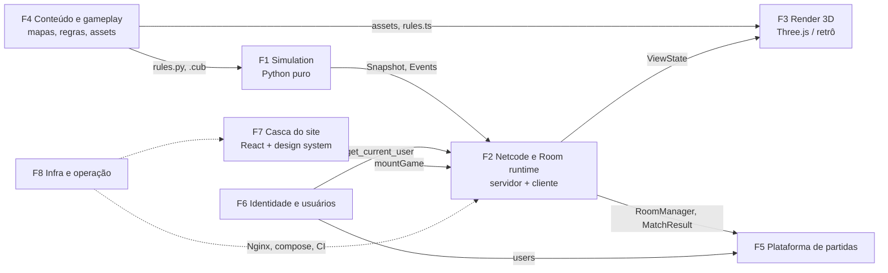

# Catacombs 42 — ideias e módulos (proposta ampliada de 18/09)

> **Documento de referência, não é o plano vigente.** Registra a proposta ampliada discutida em 18/09/2026: nove frentes, a bifurcação "um jogo ou dois", o modo retrô, e todos os módulos do subject que o jogo poderia reivindicar, em camadas. Serve para ver a ideia original e para escolher um módulo extra se sobrar tempo.
>
> O que vale hoje: escopo, tarefas e prazos em [catacombs42-plano-de-tarefas.md](catacombs42-plano-de-tarefas.md); interfaces, protocolo, contratos, constantes do Cub3D e schema em [catacombs42-web-arquitetura.md](catacombs42-web-arquitetura.md). Diferenças principais em relação ao escopo fechado em 25/09: **não** há segundo jogo (a arena da seção 3), **não** há modo retrô nem WASM, o PvP 1v1 é modo do mesmo jogo, e as camadas e as seis semanas (seções 6 e 7) foram substituídas pelo plano de tarefas. As referências a `roadmap-roberto.md` apontam para um documento pessoal; o conteúdo equivalente para o time está no doc de arquitetura.
>
> Texto original a partir daqui. Vocabulário: [CONTEXT.md](../CONTEXT.md); termos novos na seção 9.

## Sumário

1. [O que mudou desde os docs anteriores](#1-o-que-mudou-desde-os-docs-anteriores)
2. [Decisões fechadas em 18/09](#2-decisões-fechadas-em-1809)
3. [A bifurcação que o time fecha na reunião: um jogo ou dois?](#3-a-bifurcação-que-o-time-fecha-na-reunião-um-jogo-ou-dois)
4. [As frentes](#4-as-frentes)
5. [Contratos entre frentes](#5-contratos-entre-frentes-fechar-na-semana-1)
6. [Módulos do subject × frentes × camadas](#6-módulos-do-subject--frentes--camadas)
7. [As seis semanas](#7-as-seis-semanas)
8. [Riscos](#8-riscos)
9. [Termos novos propostos para o CONTEXT.md](#9-termos-novos-propostos-para-o-contextmd)
10. [O que fazer com os docs antigos](#10-o-que-fazer-com-os-docs-antigos)
11. [Fontes](#11-fontes)

---

## 1. O que mudou desde os docs anteriores

| Tema | Antes (docs de 15/09) | Agora | Por quê |
|---|---|---|---|
| Renderer | Raycaster em canvas 2D, port do Cub3D em TS, WASM depois | **Three.js (WebGL)**. O raycaster vira um segundo *adapter* de render, o "modo retrô", opcional | "Cara de FPS" pede câmera com pitch, luz e efeitos; o módulo *Advanced 3D graphics* (2 pts) exige Three.js/Babylon e não aceita canvas 2D; várias pessoas conseguem trabalhar em Three.js em paralelo, o raycaster é trabalho de uma só |
| Quem toca o jogo | Uma pessoa (slice do Tech Lead) | Duas a três, em frentes separadas por costuras (seams) | Mais gente do time quer o jogo; o subject exige contribuição de todos e cada um explica a própria parte |
| Modos | Co-op no MVP, PvP como stretch | Co-op primeiro; **PvP 1v1 na camada 2**, não na 3 | O texto do módulo *Web-based game* diz "play against each other"; o PvP fecha isso sem discussão com o avaliador |
| Jogos | Um | Um jogo com dois modos **ou** dois jogos com um motor: decisão do time (seção 3) | Dar ao time um espaço criativo próprio e talvez +2 pts (*Add another game*) |
| Prazo | ~10 semanas a partir de 15/09 | **Feature freeze 31/10, defesa 07/11** | Data real do time |
| Módulos | 24 pontos firmes, plataforma ocupando ~2,5 pessoas | Camadas: **compromisso 16, meta 22, perfumaria até 36** | Não cabe tudo em 6 semanas; "módulo pela metade vale zero" |
| Input | Setas para girar, mouse fora do MVP | **Mouse look via Pointer Lock desde o primeiro contrato** | Base de qualquer FPS; adicionar depois força mexer em Input, prediction e servidor de uma vez |
| Arma | Bola de fogo infinita com cooldown | Bola de fogo **custa mana**; mana regenera com o tempo e há pickup de mana; **armadura** absorve X de dano até quebrar | Infinita não funciona em PvP; armadura dá o "power-up" do módulo *Game customization* sem buff por tempo |
| Servidor | Autoritativo, 2,5D em grade, Room em memória, um worker | **Igual.** O Three.js só desenha; pitch é câmera, não afeta acerto | Invariante do CLAUDE.md; é o que mantém válido o port da matemática do Cub3D |

---

## 2. Decisões fechadas em 18/09

Registradas aqui para virar ADR depois (formato de 3 frases em `docs/adr/`).

1. **Three.js é o jogo.** Cena 3D real construída a partir do `.cub`: paredes viram caixas texturizadas, câmera com yaw e pitch, luz de tocha com sombra, névoa, partículas, pós-processamento. Reivindica *Advanced 3D graphics*.
2. **Retrô é um adapter de render, não um projeto.** O raycaster em canvas 2D consome o mesmo `ViewState` que o Three.js, com o mesmo input e o mesmo servidor. "Single-player" é uma Room de 1. Camada 3. Se sobrar tempo, o DDA dentro dele vira C compilado com Emscripten (WASM), e só então se decide reivindicar *módulo de escolha*.
3. **Three.js puro dentro de `frontend/game/`**, atrás do `mountGame` já contratado. Sem react-three-fiber: o loop e o estado a 30 Hz não passam pela reconciliação do React. React monta o canvas e desenha HUD, lobby e telas.
4. **Assets: os PNGs do Cub3D como base** (paredes com `NearestFilter`, inimigos/boss/itens/fireball como billboards animados com os quadros existentes, mão com bola de fogo como overlay fixo na câmera), mais alguns meshes de verdade onde o avaliador olha: porta animada, tochas, boss como modelo. Modelos novos entram se alguém quiser e der tempo; nunca bloqueiam.
5. **Co-op primeiro.** Vitória: boss derrotado; derrota: todos mortos. **Até 5 players** (mapas com 5 spawns). PvP 1v1 vem na camada 2: primeiro a 5 eliminações ou 3 minutos, respawn em spawn livre.
6. **Servidor 2,5D em grade**, como hoje. Sem pulo, agachar ou andares. Pitch é só câmera.
7. **Mouse look desde o dia 1.** `mouse_dx` (yaw) vai no Input para o servidor, que aplica e limita por tick; pitch fica no cliente. Setas continuam funcionando (e são o suficiente para o retrô).
8. **Uma arma:** bola de fogo, com a mão do Cub. Custa mana. Mana regenera com o tempo e tem pickup. Cooldown continua. Números por Ruleset (co-op generoso, arena apertado), calibrados na frente F4.
9. **Pickups:** poção (HP), chave, mana, armadura. Armadura absorve X de dano antes do HP e some quando quebra. Sem buffs por tempo (velocidade, dano dobrado). Cada pickup é um caractere novo no `.cub` e um toggle nas opções da Room.
10. **Respawn, kill feed e placar** existem (PvP usa todos; co-op usa kill feed e placar).
11. **Áudio** (passos, tiro, acerto, música) é cliente puro, entra quando der.
12. **Sem times, granadas ou hitscan.** Hitscan (tiro instantâneo) exigiria compensação de lag no servidor; projétil tolera latência e é o que o Cub já tem.
13. **Camadas:** compromisso (1) é o mínimo entregável, meta (2) é o alvo, perfumaria (3) só com a 2 verde. O plano antigo inteiro fica visível na seção 6 para o time **trocar** um item por outro, nunca somar.
14. **Feature freeze 31/10.** De 01 a 07/11: bugs, console do Chrome limpo, README, ensaio de defesa.
15. **Módulo de escolha não é planejado.** Reivindica-se na hora se o WASM do retrô acontecer. O retrô **não** é reivindicado como *Add another game*: é o mesmo jogo com outro desenho.

---

## 3. A bifurcação que o time fecha na reunião: um jogo ou dois?

| | **X — um jogo, dois modos** | **Y — dois jogos, um motor** |
|---|---|---|
| O que é | Catacombs 42 com `mode: coop \| pvp` | *Catacombs 42* (co-op na masmorra: chaves, portas, poções, inimigos, boss) e um segundo jogo com nome próprio (arena PvP: mana, armadura, respawn, placar), ambos em Three.js e no mesmo servidor |
| Código igual | Tudo das frentes F1, F2, F3, F6, F7, F8. A costura `Ruleset` (seção 4, F1) existe nos dois casos, porque co-op e PvP já têm regras diferentes | Idem |
| O que Y adiciona | — | Nome e identidade da arena; coluna `game` em `matches`; fila de matchmaking por jogo; mapas próprios; variante de HUD; telas de histórico/estatística por jogo; seção própria no README; **o time desenha a arena** (regras, mapas, ritmo) |
| Pontos | PvP é "modo" | **+2** (*Add another game*: "second distinct game, user history and statistics for this game, matchmaking system") |
| Custo além do PvP 1v1 que já está na camada 2 | 0 | ~1,5 pessoa-semana (fila, tabelas e telas por jogo, mapas, nome) |
| Risco | Nenhum novo | O avaliador dizer "é o mesmo jogo com outro modo" |

**O que torna Y defensável.** O subject pede "distinct". A defesa fica sólida se a arena tiver, e o co-op não tiver (ou vice-versa): objetivo e condição de vitória próprios (frags/tempo × boss/fuga), conjunto de entidades próprio (sem inimigos, boss, chaves e portas trancadas na arena; sem respawn e placar de frags no co-op), mapas próprios (arenas simétricas × masmorra), histórico, estatísticas e fila de matchmaking próprios, nome próprio no lobby. Doom campanha e Quake arena compartilham motor e ninguém diz que são o mesmo jogo; Pong e Pong com power-up, sim.

**Recomendação.** Construir para Y desde o dia 1, porque custa quase nada: a costura `Ruleset` é necessária de qualquer jeito, e `game` em `matches` é uma coluna. **Decidir a reivindicação em 31/10** pela lista acima, olhando para o que ficou pronto. Nenhum dos caminhos bloqueia esta divisão. O que Y exige do time é um prazo: **a arena precisa estar definida até 04/10** (checkpoint C2), senão F1 e F4 não têm o que construir na camada 2. Perguntas que a definição responde: nome; condição de vitória; tamanho e simetria dos mapas; mix de pickups; regra de respawn (tempo, spawn mais longe do inimigo); o que muda na HUD; o que é *explicitamente* diferente do co-op.

---

## 4. As frentes

Uma frente é um módulo profundo no sentido do `codebase-design`: muito comportamento atrás de uma interface pequena, colocada numa costura limpa, testável por essa interface. As costuras são o que permite duas ou três pessoas no jogo sem se atropelar. Regra de deleção: se apagar a frente e a complexidade reaparecer espalhada nas outras, ela estava rasa; se sumir, era só repasse.

Cada frente abaixo tem: o que é; interface (tudo que quem usa precisa saber, não só assinaturas); costuras; fonte no Cub3D; entrega por camada; módulos que sustenta; linguagem, tamanho e quantas pessoas cabem. Esforço em pessoa-semana (pw) é chute calibrado pelo roadmap e pelo tamanho do Cub3D, para discussão.

### F1 — Simulation (servidor, Python puro)

**O que é.** O "cub sem tela": dado o estado de uma Room, os Inputs e Actions pendentes e um `dt` fixo, produz o próximo estado e os Events. Parser `.cub`, movimento, colisão, projéteis, inimigos, boss, portas, itens, mana, armadura, respawn, condição de vitória por Ruleset, e o bot (camada 2). Sem rede, sem banco, sem desenho, sem `await`.

**Interface.**
- `parse_cub(text) -> Map` com `MapError(code)` (mesmos códigos do `cub3d_bonus.h`; caracteres novos na seção 5).
- `step(room: Room, dt: float) -> list[Event]`. Determinística: mesma sequência de Inputs, mesmos Snapshots. Ordem fixa: inputs → actions → enemies → boss → projectiles → dano → regeneração de mana → Ruleset (respawn, vitória).
- `to_snapshot(room, for_player_id) -> dict`.
- `Ruleset`: interface com **dois adapters**, `CoopRuleset` e `ArenaRuleset`: `on_start`, `on_player_death`, `check_end`, `entity_set` (quais caracteres do mapa valem), `numbers` (mana, cooldown, dano, respawn). Costura interna de F1; é o que torna X e Y o mesmo código.
- `BotPolicy.decide(room, player_id) -> Input | Action` (camada 2): escreve no Input do próprio Player a cada tick; atraso de reação e ruído de mira para "simular humano".
- Garantias que os outros dependem: `hp` inteiro; posições nunca fora do grid; `Event game_over` emitido **uma vez**; constantes só em `rules.py`.

**Costuras.** Snapshot/Events para F2. `rules.py` espelhado em `rules.ts` (F2 cliente, prediction) e revisado pela mesma pessoa nos dois lados. `Ruleset` para F4 (números e entidades). Fixtures de mapas de F4.

**Fonte no Cub3D.** `movement_bonus.c`, `move_utils_bonus.c`, `enemy_move_bonus.c`, `enemy_manage_bonus.c` (estado), `move_boss_bonus.c`, `create_*`/`update_*` de `attack_bonus/`, `door_bonus.c`, `parser_bonus/*`. Três bugs para não portar e a tabela de constantes estão em [catacombs42-web-arquitetura.md](catacombs42-web-arquitetura.md) §3 e §6.3.

**Entrega por camada.**
- 1: parser com os 33 mapas de teste; `Room`/`Player`/`Enemy`/`Boss`/`Projectile`/`Door`/`Item`; movimento por `dt` com mouse yaw; colisão player×parede/porta/enemy/player; inimigos com alvo = player vivo mais próximo e troca de alvo só com 1 célula de vantagem; boss; projéteis contínuos com sub-passo; mana e cooldown; poção, chave, mana, armadura; `CoopRuleset` (boss morto / todos mortos); suporte a 5 players; suíte de testes do roadmap §M3 + os novos (mana, armadura, 5 players); CLI que gera `snapshot.json` para o render testar sem servidor.
- 2: `ArenaRuleset` (respawn, frags, tempo, dano player×player); `options` da Room (`start_hp`, `enemy_density`, toggles de pickups, mana por ruleset); `BotPolicy`.
- 3: relâmpago como Event sincronizado (se alguém quiser).

**Módulos que sustenta.** *Web-based game* (com F2/F3), *Multiplayer 3+* (justiça entre 3–5), *AI opponent*, *Game customization* (opções aplicadas na simulação), *Add another game* se Y (ruleset e entidades distintas).

**Linguagem, tamanho, paralelismo.** Python. Camada 1 ≈ 2 pw; camada 2 ≈ 1,5 pw. Cabem **1 ou 2 pessoas**: uma no núcleo (parser, movimento, colisão, projéteis) e outra em entidades e regras (inimigos, boss, itens, mana, rulesets, bot). Quem conhece o C do Cub3D é o revisor natural do núcleo.

### F2 — Netcode e Room runtime (servidor e cliente)

**O que é.** Tudo que leva Input do teclado e do mouse até a Simulation e Snapshot da Simulation até o renderer, nas duas máquinas. Servidor: `RoomManager`, uma `asyncio.Task` por Room com tick fixo (30 Hz) e Snapshot a cada 2 ticks (15 Hz), protocolo WebSocket (`v`, `type`), `ConnectionManager`, grace period e Reconnection, espectador, backpressure para cliente lento, métricas. Cliente: socket, fila de Inputs com `Seq`, Prediction, Reconciliation, Interpolation, Pointer Lock, `applyInput.ts` (mesma matemática de `sim.py`), e a montagem `mountGame` que a casca chama.

**Interface.**
- Mensagens da seção 6.2 do roadmap, mais `mouse_dx` no `input` e `mana`, `armor`, `scoreboard`, `killfeed` nos Snapshots/Events. Códigos de fechamento `44xx`/`4503`.
- `RoomManager.create/join/leave/start/info` e `record_match_result(match_id, MatchResult)` (contrato 6.3 do roadmap, mais `game` se Y).
- `ConnectionManager.connect/disconnect/send_to_user/broadcast/is_online/online_users` (contrato 6.4).
- `mountGame(canvas, opts) -> { unmount }` com `MountOptions`/`HudState` (contrato 6.5, campos novos: `mana`, `maxMana`, `armor`, `scoreboard`, `killfeed`, `theme`).
- `ViewState`: o que F2 entrega a F3 a cada frame do navegador: o Player próprio já previsto, os outros interpolados a `now − 100 ms`, entidades, portas, grid, e o `Map`. F3 não sabe que existe rede.
- Garantias: o `dt` aplicado é sempre o do servidor; `Seq` só cresce; Inputs além de 60/s são ignorados; um cliente lento nunca trava a Room; a Room nunca depende do socket de ninguém para continuar.

**Costuras.** Snapshot com F1. `ViewState` com F3 (F3 tem dois adapters e ambos consomem só isso). `RoomManager`/`MatchResult` com F5. `get_current_user`/`authenticate_ws_token` com F6. `mountGame` com F7. Rotas `/ws/game` e um worker com F8.

**Fonte no Cub3D.** `controls_bonus.c` (mapeamento de teclas), `movement_bonus.c` de novo, para `applyInput.ts`.

**Entrega por camada.**
- 1: Room runtime, protocolo, WS com N players, Snapshot/Events, Reconnection com grace 30 s, Prediction/Reconciliation/Interpolation, Pointer Lock, `ping/pong` com RTT na HUD, `record_match_result` chamado uma vez, métricas em `/metrics`, teste de aceite com throttling (100 ms + 2 % de perda, 5 min sem teleporte).
- 2: espectador (Player morto e `role: "spectator"`), `Tab` para trocar câmera.
- 3: binário no lugar de JSON se a banda incomodar.

**Módulos que sustenta.** *Real-time features (WebSockets)*, *Remote players*, *Spectator mode*, *Multiplayer 3+* (sincronização), *Web-based game*.

**Linguagem, tamanho, paralelismo.** Python (servidor) e TypeScript (cliente). Camada 1 ≈ 3,5 pw. Cabe **1 pessoa** nos dois lados; dividir servidor/cliente entre duas funciona se a mesma pessoa revisar `applyInput.ts` contra `sim.py`.

### F3 — Render 3D (cliente)

**O que é.** Quem desenha. Recebe `Map` e `ViewState` e produz pixels. Adapter principal em Three.js; adapter retrô com o raycaster (camada 3). Cena, câmera, materiais, luz, sombra, névoa, partículas, pós-processamento, billboards animados, meshes, overlay da mão com bola de fogo, minimapa, áudio.

**Interface.**
- `Renderer { init(map, assets): Promise<void>; render(view: ViewState, dt: number): void; resize(w, h): void; dispose(): void }`. **Dois adapters** (`ThreeRenderer`, `RetroRenderer`) escolhidos por `theme`. É a costura que força o Three.js a consumir só o estado, sem rede e sem React.
- `AssetLoader`: carrega PNGs, GLTF e sons; falha de carregamento vira estado de erro na tela (`HudState.status = "error"`), nunca warning no console.
- Garantias: 60 fps num laptop de sala com 5 players, 20 inimigos e 10 projéteis; `dispose()` libera GPU (trocar de Room não vaza); resolução interna independente do CSS.

**Costuras.** `ViewState` com F2. Assets e `rules.ts` (FOV, alturas de sprite) com F4. Canvas e overlay de HUD com F7.

**Fonte no Cub3D.** Só para o retrô: `init_ray_bonus.c`, `dda_bonus.c`, `raycasting_utils_bonus.c`, `enemy_position_bonus.c`, `enemy_sort_bonus.c`, `render_*`. Para o Three.js, os PNGs e a ideia de `less_height` (itens "sentam" no chão).

**Entrega por camada.**
- 1: mundo a partir do grid (caixas por célula, chão e teto), câmera FPS com yaw/pitch, portas como mesh animado, billboards animados para inimigos/boss/itens/projéteis/outros players, mão com bola de fogo, tochas como point lights com sombra, névoa, partículas do projétil e do acerto, bloom leve, minimapa, kill feed e placar via `onHud`. `dev.html` que roda com `snapshot.json` da CLI de F1 antes de existir servidor.
- 2: modelos GLTF onde compensar (boss, tochas), efeitos de morte e respawn, áudio.
- 3: `RetroRenderer` (raycaster em TS, 640×360, texturas do Cub3D); DDA em WASM dentro dele.

**Módulos que sustenta.** *Advanced 3D graphics* (o "advanced" é a lista de técnicas da camada 1: luz dinâmica com sombra, névoa, partículas, pós-processamento, instancing das paredes), *Game customization* ("themes" = retrô), *módulo de escolha* se o WASM acontecer.

**Linguagem, tamanho, paralelismo.** TypeScript + Three.js. Camada 1 ≈ 3,5 pw; camada 3 ≈ 3 pw. Cabem **1 ou 2 pessoas**: uma na cena, luz e materiais; outra em sprites, efeitos, overlay e áudio. O retrô é de quem quiser, fora do caminho crítico.

### F4 — Conteúdo e gameplay (dados e design)

**O que é.** O que faz o jogo ser *este* jogo e não outro: mapas, constantes, entidades, pickups, rulesets, HUD, assets. É a frente onde a criatividade do time entra, e é a que Y transforma em duas (masmorra e arena). Transversal por natureza: um pickup novo é um caractere no parser (F1), uma regra em `step` (F1), um billboard (F3) e um campo na HUD (F7). Por isso é **orientada a dados**: quem faz conteúdo edita `rules.py`/`rules.ts`, `.cub` e `assets/`, e abre issue nas outras frentes só quando precisa de comportamento novo.

**Interface.**
- Formato `.cub` estendido: além de `1 0 N S E W D K P I B`, os caracteres `M` (mana), `A` (armadura), `T` (tocha: luz no cliente, célula livre no servidor). Vários spawns `N/S/E/W`; a Room exige `len(spawns) >= max_players`.
- `rules.py`/`rules.ts` com os mesmos nomes: velocidades, raios, danos, cooldown, `MANA_MAX`, `FIREBALL_MANA_COST`, `MANA_REGEN_PER_S`, `ARMOR_POINTS`, tempos de respawn, limites de frags/tempo. Por Ruleset.
- `maps/<jogo>/*.cub` com 5 spawns (co-op) ou spawns simétricos (arena).
- `assets/`: PNGs do Cub3D, meshes novos, sons.
- Especificação da HUD (o que aparece e quando) como documento curto para F7.

**Entrega por camada.**
- 1: mapas atuais com 5 spawns e `M`/`A`/`T`; números do co-op calibrados (mana generosa); spec da HUD co-op.
- 2: design da arena (nome, regras, mapas simétricos, mix de pickups, respawn, números apertados); spec da HUD PvP; opções de customização e defaults.
- 3: mapas extras, modelos novos, trilha sonora.

**Módulos que sustenta.** *Game customization* (power-ups = armadura/mana, mapas, opções com defaults), *Add another game* se Y (o que torna a arena "distinct"), e alimenta *AI opponent* (o bot precisa usar as opções).

**Linguagem, tamanho, paralelismo.** Arquivos de dados, um pouco de Python/TS para constantes, ferramentas de mapa (texto). Camada 1 ≈ 0,5 pw; camada 2 ≈ 1,5 pw. **1 pessoa dona, todo mundo contribui** com ideias e mapas. Se Y, a arena tem prazo: definida até 04/10.

### F5 — Plataforma de partidas (backend e telas)

**O que é.** Tudo que acontece antes e depois de uma Room: Lobby (criar, convidar, entrar, pronto, iniciar), fila de matchmaking por Mode (e por jogo, se Y), ciclo de vida do Match, `record_match_result`, histórico, estatísticas, leaderboard, entrada de espectador, torneio (camada 3), gamificação (camada 3). Dona das tabelas `matches`, `match_players`, `player_stats`, `tournaments`.

**Interface.**
- `POST /api/matches` (mode, map, max_players, options[, game]) → `room_id`; `POST /api/matches/{id}/start`; `GET /api/matches/{id}`; `GET /api/users/{id}/matches`; `GET /api/leaderboard`; `GET /api/rooms/live` (via `RoomManager.info`, nunca do banco).
- `record_match_result(match_id, MatchResult)` **idempotente**; `MatchResult`/`MatchPlayerResult` do roadmap §6.3 mais `mana_used`, `armor_absorbed`, `frags` (arena).
- Garantia: estado de partida em andamento nunca vai para o banco; a corrida "dois na última vaga" é resolvida por `RoomManager.join` (atômico no event loop) e a API só reflete.

**Costuras.** `RoomManager`/`MatchResult` com F2. `users` com F6. Componentes de F7 para as telas. Migrações Alembic (F5 é dona do schema de partidas; F6 do de usuários; tabela nova entra por PR revisado por quem for dono).

**Entrega por camada.**
- 1: `matches`/`match_players`, criar/entrar/pronto/iniciar, `record_match_result`, telas de lobby e resultado, `startup` que marca `running` → `aborted`.
- 2: histórico, estatísticas por User, leaderboard, entrada de espectador em Room em andamento, fila por jogo se Y.
- 3: torneio (chaveamento sobre Rooms PvP), gamificação (conquistas, XP, badges).

**Módulos que sustenta.** *ORM* (com F6), *Game statistics & match history*, *Tournament*, *Gamification*, *Spectator* (a porta de entrada), *Add another game* se Y (história e matchmaking por jogo).

**Linguagem, tamanho, paralelismo.** Python/FastAPI + SQLAlchemy + Alembic, TypeScript para as telas. Camada 1 ≈ 1,5 pw; camada 2 ≈ 0,7 pw; camada 3 ≈ 2,5 pw. **1 pessoa.**

### F6 — Identidade e usuários (backend compartilhado)

**O que é.** Quem o User é e o que todo endpoint do backend recebe de graça. Cadastro e login (e-mail + senha, Argon2id), JWT de acesso, refresh com rotação e detecção de reuso, logout, OAuth 2.0 com a 42 (ou 2FA), `get_current_user`, `authenticate_ws_token`, rate limit, envelope de erro, logging com `request_id`, e a parte de servidor do perfil: edição, avatar com validação e default, amigos, status online. Dona das tabelas `users`, `refresh_tokens`, `oauth_accounts`, `friendships`, `blocks`.

**Interface.** Contrato 6.1 do roadmap (auth) mais `GET/PATCH /api/users/me`, `POST /api/users/me/avatar`, `GET /api/users/{id}`, `POST/DELETE /api/friends/{id}`, `GET /api/friends`, `GET /api/users/online`. `CurrentUser = Annotated[User, Depends(get_current_user)]`. Envelope `{"error": {"code", "message", "request_id", "fields"}}`. Decisões 1–6 e 9 da seção 4 do roadmap valem sem mudança.

**Costuras.** `Depends` e envelope para F2 e F5. `is_online` vem do `ConnectionManager` de F2 (callback `on_presence_change`). Telas de F7.

**Entrega por camada.**
- 1: auth completa com testes; rate limit; logging; erros; perfil, avatar, amigos, status online; OAuth 42 (plano B: TOTP).
- 2: —
- 3: bloqueio de usuário se o chat entrar (F9).

**Módulos que sustenta.** *Standard user management* (com F7), *OAuth* ou *2FA*, *Framework backend* (metade do Major), *ORM* (com F5).

**Linguagem, tamanho, paralelismo.** Python/FastAPI. Camada 1 ≈ 4 pw (auth 2, perfil/amigos 1,5, OAuth 0,5). **1 pessoa.** É o gargalo da semana 1: nenhuma tela ou tabela com dono existe sem `get_current_user`.

### F7 — Casca do site (React e design system)

**O que é.** O site em volta do jogo: React com roteamento, layout, tema, design system com ≥ 10 componentes reutilizáveis (paleta, tipografia, ícones), telas de login/cadastro, perfil próprio e de terceiros, amigos, Privacy Policy e Terms of Service (obrigatórias; ausência é rejeição), a rota `/play/:roomId` que monta o canvas e a HUD, telas de lobby/histórico/resultado com dados de F5. Responsivo e acessível.

**Interface.** Componentes exportados com props tipadas e documentadas (uma página de catálogo dentro do próprio site vale como "design system" na defesa). `/play/:roomId` chama `mountGame` com `getAccessToken`, `onHud`, `onEnd`, `theme`. A HUD é React: recebe `HudState` e desenha HP, mana, armadura, chaves, ping, placar, kill feed, lista de players. Regra: `frontend/game/` não importa nada de `frontend/src/`; a casca importa o jogo.

**Costuras.** `mountGame`/`HudState` com F2. APIs de F5 e F6. Rotas do Nginx com F8.

**Entrega por camada.**
- 1: casca navegável, login/cadastro/perfil/amigos, páginas legais, `/play`, HUD co-op, lobby e resultado; console do Chrome vazio.
- 2: design system com catálogo e ≥ 10 componentes; HUD PvP; telas de histórico e leaderboard.
- 3: i18n com 3 idiomas.

**Módulos que sustenta.** *Framework frontend* (a outra metade do Major), *Custom design system*, *Standard user management* (telas), *i18n* (camada 3).

**Linguagem, tamanho, paralelismo.** TypeScript + React + framework CSS (escolha da PO). Camada 1 ≈ 2 pw; camada 2 ≈ 0,5 pw. **1 pessoa**, revisando o frontend das outras frentes.

### F8 — Infra e operação

**O que é.** `docker compose up` de um comando com TLS e `wss://`, Nginx com `/`, `/api/`, `/ws/game` (e `/ws/chat` se F9), redirect 80→443, certificado local sem warning (mkcert), `.env.example`, CI com build das imagens e `pytest` e `vitest`, health check, um worker de backend (documentado), estrutura do README exigida pelo subject, Prometheus/Grafana (camada 3).

**Interface.** Rotas do Nginx, nomes de serviço da rede do compose, variáveis do `.env.example`, o que o CI roda em cada PR, endereço da demo.

**Entrega por camada.**
- 1: compose com TLS e WSS, CI verde, `.env.example`, README com as seções obrigatórias (todos escrevem a própria parte; F8 mantém o esqueleto).
- 2: —
- 3: Prometheus + Grafana com alertas e acesso protegido; health/status page com backup do Postgres.

**Módulos que sustenta.** Nenhum na camada 1 (é tudo obrigatório). *Monitoring* e *Health check/backups* na camada 3.

**Linguagem, tamanho, paralelismo.** Dockerfile, YAML, nginx.conf, shell, Markdown. Camada 1 ≈ 1 pw + 1 pw de README/defesa; camada 3 ≈ 2 pw. **Meia pessoa**, naturalmente a PM.

### F9 — Social em tempo real (só camada 3)

Chat por WebSocket usando o `ConnectionManager` de F2, histórico persistido, indicador de digitação, bloqueio, convite para partida a partir do chat (chama F5), notificações de criação/atualização/remoção. ≈ 2,5 pw para 4 pontos (*User interaction* 2, *Advanced chat* 1, *Notifications* 1): é o melhor item da camada 3 em pontos por semana, e o que mais tira uma pessoa do jogo. Entra só por troca explícita.

---

## 5. Contratos entre frentes (fechar na semana 1)

| # | Contrato | Entre | Conteúdo | Onde vive |
|---|---|---|---|---|
| 1 | Snapshot, Events e mensagens WS | F1 ↔ F2 ↔ F3 | Roadmap §6.2 + `mouse_dx`, `mana`, `armor`, `scoreboard`, `killfeed`, `theme`; `snapshot.example.json` com 5 players | `docs/contracts/ws-messages.md`, `snapshot.example.json`, `protocol.py`, `types.ts` |
| 2 | `Renderer` | F2 → F3 (dois adapters) | `init/render/resize/dispose`, `ViewState`, `AssetLoader` | `frontend/game/src/render/renderer.ts` |
| 3 | `Ruleset` | F1 (dois adapters), F4 | `on_start/on_player_death/check_end/entity_set/numbers` | `app/game/rulesets/` |
| 4 | `rules.py` ↔ `rules.ts` e `sim.py` ↔ `applyInput.ts` | F1 ↔ F2 | Mesmos nomes, mesmas fórmulas, mesmo `dt`; qualquer mudança passa pelo dono de F1 | `app/game/rules.py`, `frontend/game/src/rules.ts` |
| 5 | `RoomManager` e `MatchResult` | F2 ↔ F5 | Roadmap §6.3 + campos novos; `game` se Y | `docs/contracts/rooms.md` |
| 6 | `mountGame`, `MountOptions`, `HudState` | F2/F3 ↔ F7 | Roadmap §6.5 + campos novos | `frontend/game/src/index.ts` |
| 7 | Auth, `Depends`, envelope, rate limit | F6 ↔ todos | Roadmap §6.1 + endpoints de perfil/amigos | `docs/contracts/auth.md` |
| 8 | Formato `.cub` estendido | F4 ↔ F1, F3 | `M`, `A`, `T`, vários spawns, pastas por jogo | `docs/contracts/map-format.md` |
| 9 | Rotas, rede, um worker, CI | F8 ↔ todos | Nginx, nomes de serviço, `.env.example`, o que o CI exige | `docs/contracts/infra.md`, README |
| 10 | `ConnectionManager` | F2 ↔ F6 (presença) e F9 | Roadmap §6.4 | `docs/contracts/ws-manager.md` |

Regra: contrato muda no **mesmo PR** que muda o código, e o PR cita o número do contrato.

---

## 6. Módulos do subject × frentes × camadas

| Módulo (subject v19) | Pts | Frentes | Camada |
|---|---|---|---|
| Web-based game (against each other) | 2 | F1, F2, F3 | 1 (PvP na 2 é o que fecha "against") |
| Real-time features (WebSockets) | 2 | F2 | 1 |
| Remote players (latência, reconexão) | 2 | F2 | 1 |
| Multiplayer 3+ | 2 | F1, F2, F4 | 1 |
| Framework front + back | 2 | F7, F6 | 1 |
| ORM | 1 | F5, F6 | 1 |
| Standard user management | 2 | F6, F7 | 1 |
| OAuth 2.0 (ou 2FA) | 1 | F6 | 1 |
| Advanced 3D graphics | 2 | F3 | 1 |
| **Subtotal camada 1: compromisso** | **16** | | |
| Game customization | 1 | F4, F1, F5 | 2 |
| Spectator mode | 1 | F2, F5 | 2 |
| Game statistics & match history | 1 | F5 | 2 |
| AI opponent | 2 | F1 | 2 |
| Custom design system | 1 | F7 | 2 |
| PvP 1v1 (sem ponto próprio; garante o claim do jogo) | 0 | F1, F4 | 2 |
| **Subtotal camada 2: meta** | **22** | | |
| Add another game (**só se Y**, e só se passar na lista da seção 3) | 2 | F4, F5 | 2 se Y |
| User interaction (chat + perfil + amigos) | 2 | F9 | 3 |
| Advanced chat | 1 | F9 | 3 |
| Notification system | 1 | F9 | 3 |
| Monitoring (Prometheus + Grafana) | 2 | F8 | 3 |
| Tournament | 1 | F5 | 3 |
| Gamification | 1 | F5, F7 | 3 |
| Health check + backups | 1 | F8 | 3 |
| i18n (3 idiomas) | 1 | F7 | 3 |
| Módulo de escolha: DDA em WASM no retrô | 1–2 | F3 | 3, oportunista |
| **Teto se tudo entrar** | **36** | | |

Esforço por camada (pw): 1 ≈ 19–20 · 2 ≈ 5 · 3 ≈ 11. Capacidade até 31/10: 30 pw no papel, 20–24 realistas. **A camada 1 sozinha consome a capacidade realista.** Trocas típicas se o time quiser um item da 3: chat no lugar de bot + espectador + design system (mesmos 4 pontos, tira uma pessoa do jogo); Prometheus no lugar de estatísticas + espectador (perde 0 pontos, ganha 2, custa 1 pw a mais); retrô no lugar de nada, porque não pontua: é prêmio por fechar a camada 2.

---

## 7. As seis semanas

Checkpoints são demos de integração na sexta, com todo mundo na mesma chamada. Um checkpoint não fechado é o assunto da reunião de segunda.

| Semana | F1 Simulation | F2 Netcode | F3 Render | F4 Conteúdo | F5 Partidas | F6 Identidade | F7 Casca | F8 Infra |
|---|---|---|---|---|---|---|---|---|
| **S1** 21–27/09 | parser + 33 fixtures; movimento por `dt` com testes | contratos 1, 2, 5, 6 publicados; esqueleto `app/`; `ConnectionManager` | `dev.html`: grid vira caixas, câmera FPS, Pointer Lock, a partir de `snapshot.example.json` | contrato 8; mapas com 5 spawns e `M A T`; `rules.py`/`rules.ts` v1 | schema `matches`/`match_players` | signup/login/`me` via Nginx; contrato 7 | React + roteamento + páginas legais + login | TLS + WSS + CI verde; contrato 9 |
| **C1** 27/09 | *Parser e movimento verdes; masmorra em 3D no `dev.html`; login pelo Nginx com cadeado* | | | | | | | |
| **S2** 28/09–04/10 | inimigos, boss, projéteis, portas, itens, mana, armadura, `CoopRuleset`; CLI de snapshot | Room runtime, protocolo, WS com 1 player | billboards animados, portas mesh, tochas com sombra, mão | **arena definida (se Y)**; números co-op | criar/entrar/pronto/iniciar; lobby | refresh, logout, rate limit, envelope, logging | perfil, amigos, `/play` monta `mountGame` | health check; `.env.example` |
| **C2** 04/10 | *Um player anda em 3D com movimento decidido pelo servidor, via `wss://`; lobby cria Room* | | | | | | | |
| **S3** 05–11/10 | 5 players, justiça de alvo, testes de performance | N players, Prediction/Reconciliation/Interpolation, throttling | névoa, partículas, bloom, minimapa, HUD via `onHud` | spec HUD; mapas revisados | `record_match_result`, tela de resultado | avatar, status online | HUD co-op, lobby e resultado com componentes | README esqueleto |
| **C3** 11/10 | *Duas máquinas jogam co-op até o boss morrer; prediction ligada; Match gravado* | | | | | | | |
| **S4** 12–18/10 | `options` da Room; `ArenaRuleset` | Reconnection + grace; espectador | efeitos de morte/respawn; áudio; `dispose` limpo | design final da arena; opções e defaults | histórico, estatísticas, leaderboard, espectador | OAuth 42 (ou TOTP) | histórico, leaderboard, HUD PvP | — |
| **C4** 18/10 | *Fechar a aba e voltar; morto vira espectador; estatísticas reais; OAuth entra* | | | | | | | |
| **S5** 19–25/10 | `BotPolicy` | teste de carga 4 Rooms × 5 players, p99 do tick < 5 ms | modelos GLTF onde compensar; polimento | mapas da arena; calibração PvP | fila por jogo (se Y); `game` em `matches` | — | catálogo do design system (≥ 10) | — |
| **C5** 25/10 | *Toda a camada 2 demonstrável: bot, PvP/arena 1v1, opções, espectador, 5 players* | | | | | | | |
| **S6** 26/10–01/11 | só bug | só bug | só bug (+ retrô se sobrar, fora do caminho crítico) | só ajuste de número | só bug | só bug | console do Chrome vazio em todas as telas | README: módulos e contribuições |
| **C6** 31/10 | *Feature freeze. Decisão X/Y pela lista da seção 3. Nada novo entra.* | | | | | | | |
| **S7** 02–08/11 | Ensaio de defesa: cada pessoa explica a própria frente com o código aberto; "modificação rápida" treinada (dano da fireball, campo novo no Snapshot, tecla da porta) | | | | | | | |

Ordem de prioridade se apertar, por frente: F6 camada 1 > F2 > F1 > F3 > F5 > F7 > F4 > tudo da camada 2. Cortar escopo **dentro** da camada (menos inimigos, menos telas), nunca pular o critério de aceite de um checkpoint.

---

## 8. Riscos

| Risco | Sinal precoce | Plano B |
|---|---|---|
| Three.js é novo para todo mundo | C1 sem masmorra no `dev.html` | Reduzir a camada 1 de F3 a caixas texturizadas + billboards + uma luz; "advanced" vira camada 2 |
| Prediction diverge (fórmulas diferentes em `sim.py` e `applyInput.ts`) | `console.assert` de reconciliação dispara em C3 | Uma pessoa dona dos dois arquivos; teste que roda a mesma sequência de Inputs em Python e TS e compara |
| F6 atrasa e trava o time | S1 sem `me` via Nginx | Access de 8 h temporário sem refresh; refresh na S2 |
| Avaliador não aceita *Add another game* | Lista da seção 3 com item em aberto em 31/10 | Não reivindicar; a arena continua como modo, pontos não mudam |
| 5 players na demo | Laptop de sala engasga com 5 abas | Demo com 3 máquinas + 2 abas; `Multiplayer 3+` pede 3, não 5 |
| Warning no console do Chrome | Qualquer um, em qualquer tela | Bug bloqueante desde S1; CI com teste de smoke no navegador se der tempo |
| Módulo pela metade | Checkpoint C5 com item da camada 2 "quase" | Corta em C5, não em C6; o que não demonstra inteiro sai do README |
| Retrô compete com a camada 2 | Alguém no retrô antes de C5 | Retrô só depois de C5, ou fora do horário do projeto |

---

## 9. Termos novos propostos para o CONTEXT.md

Para o time aprovar e o Tech Lead aplicar; nenhum foi adicionado ainda.

- **Frente**: uma das nove partes do projeto desta divisão, com interface, costuras e módulos próprios. Uma pessoa pode ser dona de mais de uma; uma frente pode ter duas pessoas. _Evitar_: área, módulo, slice (para isto).
- **Slice** (redefinir): o conjunto de frentes de que uma pessoa é dona.
- **Camada**: compromisso (1), meta (2), perfumaria (3). _Evitar_: tier, fase, sprint.
- **Ruleset**: as regras de um Mode aplicadas pela Simulation: entidades válidas, vitória, respawn, números. Dois adapters: `coop` e `arena`.
- **Arena**: o Mode PvP (ou o segundo jogo, se Y). _Evitar_: deathmatch, pvp (em código, `arena`).
- **Mana**: recurso gasto pela bola de fogo; regenera por segundo e é reposto por Pickup.
- **Armor**: pontos que absorvem dano antes do HP e somem ao chegar a zero.
- **Pickup**: generaliza Item: `key`, `potion`, `mana`, `armor`. Some do Grid ao ser pisado.
- **Renderer**: o adapter do cliente que desenha um ViewState. Dois: `three` (padrão) e `retro`. **Theme** é o nome que o User vê.
- **ViewState**: o que F2 entrega ao Renderer a cada frame: Player próprio previsto, os outros interpolados, entidades, portas, grid, Map. _Evitar_: state, scene.
- **Checkpoint**: demo de integração de sexta-feira, com critério observável.

---

## 10. O que fazer com os docs antigos

_Seção executada em 25/09/2026:_ o doc de arquitetura foi reescrito para o escopo fechado (Three.js, contratos, constantes e schema); o antigo `catacombs42-divisao-de-trabalho.md` saiu (papéis e regra de contingência estão na parte 2 do plano de tarefas; a lista de tabelas está na §10.3 da arquitetura); os termos da seção 9 entram no [CONTEXT.md](../CONTEXT.md) depois da reunião de alocação.

---

## 11. Fontes

- Subject v19, capítulo IV: texto dos módulos *Web-based game*, *Advanced 3D graphics*, *Add another game*, *Game customization* — [transcendence.md](transcendence.md)
- Three.js — documentação e exemplos: https://threejs.org/docs/ e https://threejs.org/examples/ (luzes e sombras, `Sprite`, `InstancedMesh`, `EffectComposer`/`UnrealBloomPass`, `GLTFLoader`)
- MDN — Pointer Lock API: https://developer.mozilla.org/en-US/docs/Web/API/Pointer_Lock_API
- Gabriel Gambetta — *Fast-Paced Multiplayer*: https://www.gabrielgambetta.com/client-server-game-architecture.html
- Valve — *Source Multiplayer Networking* (inclui por que hitscan exige lag compensation): https://developer.valvesoftware.com/wiki/Source_Multiplayer_Networking
- Glenn Fiedler — *Fix Your Timestep!*: https://gafferongames.com/post/fix_your_timestep/
- John Ousterhout — *A Philosophy of Software Design* (módulos profundos), e Michael Feathers — *Working Effectively with Legacy Code* (seams): base do vocabulário da seção 4
- Precedente na 42 — cub3D no Transcendence com servidor autoritativo: https://github.com/samatsum/ft_Transcendence
- Kenney (https://kenney.nl/assets) e Quaternius (https://quaternius.com/) — packs de modelos low-poly gratuitos, se F3 quiser meshes além dos PNGs do Cub3D
