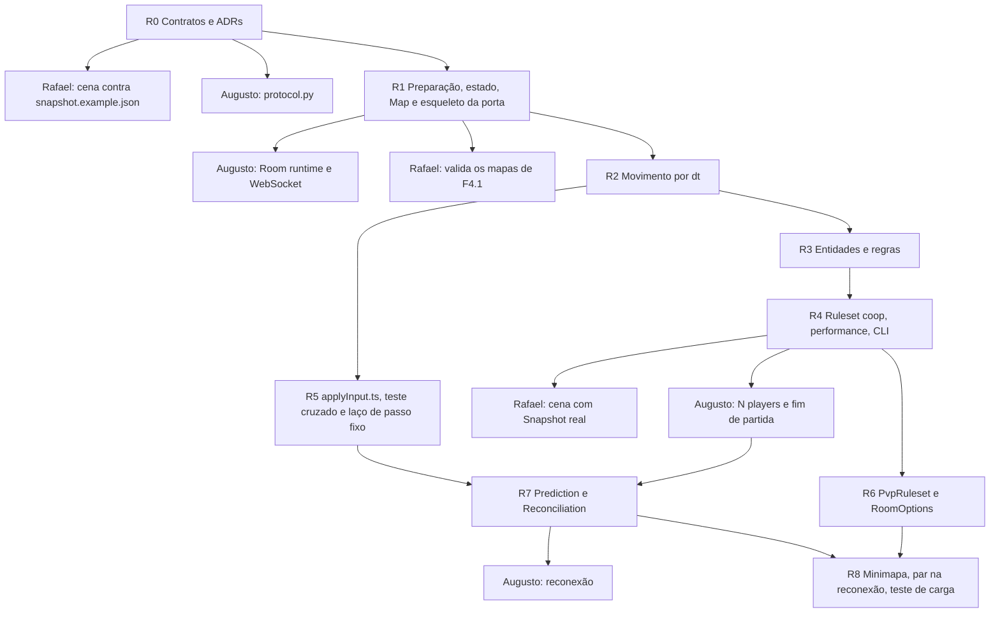

# Roadmap do Roberto — Caminho 1: Simulation e Prediction (Tech Lead)

> Guia de execução da Slice 1. O [documento de Slice](slices/caminho-1-roberto.md) é o resumo para o time: escopo, dependências e datas. Este arquivo é o detalhe para trabalhar: em que ordem você ataca, os passos de cada tarefa, a lista de testes que decide "pronto", as armadilhas do C e o que estudar antes. Vocabulário: [CONTEXT.md](../CONTEXT.md). Quando este arquivo divergir do [plano](catacombs42-plano-de-tarefas.md) ou de um [contrato](contracts/README.md), o plano e o contrato mandam.
>
> Reescrito em 07/10/2026, com o calendário replanejado ([pm/replanejamento-e-board.md](pm/replanejamento-e-board.md)) e as decisões de 02 a 07/10. A versão de 02/10 ainda mandava medir o fps do Cub3D e previa `enemy_density`; a seção 2 lista o que mudou.

## Sumário

1. [Como ler este documento](#1-como-ler-este-documento)
2. [O que mudou desde 02/10](#2-o-que-mudou-desde-0210)
3. [O que você entrega e para quem](#3-o-que-você-entrega-e-para-quem)
4. [Estado atual](#4-estado-atual)
5. [A porta da Simulation](#5-a-porta-da-simulation)
6. [Milestones R0–R8](#6-milestones)
7. [Perguntas de pesquisa](#7-perguntas-de-pesquisa)
8. [Trilha de aprendizado](#8-trilha-de-aprendizado)
9. [Rotina de Tech Lead](#9-rotina-de-tech-lead)
10. [Riscos da sua Slice e plano B](#10-riscos-da-sua-slice-e-plano-b)
11. [Checklist de defesa](#11-checklist-de-defesa)
12. [Fontes](#12-fontes)

---

## 1. Como ler este documento

Cada milestone tem:

- **Objetivo**: uma frase. Se não couber em uma frase, o milestone está grande demais.
- **Passos**: de meio dia a um dia cada. Cada passo termina num conjunto de testes verdes e pode virar um PR pequeno.
- **Testes**: a lista que decide "pronto". Você escreve o teste primeiro, vê falhar e implementa.
- **Critério de aceite**: o do plano, sempre observável.
- **Desbloqueia**: quem no time está esperando. É a régua de prioridade quando faltar tempo.
- **Aprender antes**: o que estudar antes de abrir o editor, com o sinal de que você aprendeu.
- **Armadilhas**: o que dá errado se você não souber de antemão. Várias vêm do próprio código C.

Regra do subject: módulo pela metade vale zero. Se a semana apertar, corte escopo dentro do milestone, nunca o critério de aceite.

Regra de integridade: você escreve o código. Este documento dá interfaces, listas de testes e perguntas; nunca o corpo de uma função. Na defesa você explica o que cada parte faz e por que está feita assim, inclusive a matemática que veio do C.

---

## 2. O que mudou desde 02/10

| Na versão de 02/10 | Agora | Onde está escrito |
|---|---|---|
| Medir o fps do Cub3D para fixar `PLAYER_SPEED` | Não se mede: `3.6` e `1.8` são ponto de partida, decididos jogando | [rules.md](contracts/rules.md) §5 |
| Projétil a 2,5 cél/s | Ponto de partida `12`; o C andava a cerca de 30 | rules.md §5 |
| Boss com cadência de 2,2 s "a conferir" | O port implementa a regra pretendida, com três constantes; o comportamento real do C é a mesma regra com outros dois números | rules.md §2.4 e §5 |
| `enemy_density: double` | Saiu. No máximo 20 Enemies por Map | [map-format.md](contracts/map-format.md) §4 |
| O Player trava na parede, como no C (pergunta 4) | O Player desliza: o passo é tentado em `x` e depois em `y` | [ws-messages.md](contracts/ws-messages.md) §2.9 |
| A diagonal é 1,41 vez mais rápida (pergunta 5) | As teclas viram um vetor de intenção normalizado | ws-messages.md §2.9 |
| Direção guardada como vetor (pergunta 6) | Guardada como ângulo; no fio vai `(dx, dy)` | rules.md §4 |
| A Room guarda o último Input do Player | Fila por Player: um Input por Tick, nunca repetido | ws-messages.md §2.9 |
| Uma Door pode fechar com alguém dentro? (pergunta 13) | Door aberta não fecha | ws-messages.md §4 |
| A Room tem `status = "lobby"` | A Room da Simulation nasce no `start`; o Lobby é do `RoomManager` | [rooms.md](contracts/rooms.md) §4 |
| `map` dentro de `RoomOptions` | `map` é parâmetro de criação, fora de `options` | [room-options.md](contracts/room-options.md) |
| O Augusto mexe nos campos da Room | Ele só chama funções ([seção 5](#5-a-porta-da-simulation)) | este arquivo |
| Quem escreve o laço de passo fixo do cliente (pergunta 17) | Você, com a interface fechada com o Augusto até 11/10 | R5 |
| Calendário de segunda a domingo, defesa em 09/11 | Domingo a sábado, checkpoint na sexta, defesa em 21/11 | [replanejamento](pm/replanejamento-e-board.md) |
| Arquivo fora do git | Versionado | — |

---

## 3. O que você entrega e para quem



Leitura do grafo: **R1 a R4 estão no caminho crítico do time.** O esqueleto da porta, em R1, tira o Augusto da sua fila: ele liga a Room com a interface final e só movimento por dentro, e as regras entram depois sem mudar nada do lado dele.

Ordem de prioridade quando o tempo apertar: **R1 > R2 > R3 > R4 > R5 > R7 > R6 > R8**. O minimapa de R8 é o primeiro a sair: o plano (§9) já prevê devolvê-lo ao Rafael. O PvP de R6 não é cortável.

---

## 4. Estado atual

Em 07/10/2026:

- **Código:** nenhum. O backend é um `main.py` de duas rotas. `backend/app/` nasce com o Augusto (F0.3) e o projeto TypeScript com o Caio (F0.4); a pasta `backend/app/game/` nasce com você, combinado com o Augusto.
- **Contratos:** os dez de `docs/contracts/` existem. Faltam `auth.md` e `ws-manager.md` (Augusto) e `i18n.md` (Caio); nenhum trava a Simulation.
- **R0:** feito. Sobram o ADR 002 (tokens, com o Augusto) e as pendências entre Slices da [seção 5 do documento de Slice](slices/caminho-1-roberto.md#5-decisões-a-travar-antes-de-escrever-código).
- **Board:** sem issue de tarefa. As suas, até a S2, estão escritas no [documento de Slice §9](slices/caminho-1-roberto.md#9-issues-prontas-até-a-s2).
- **CI:** sobe o compose e confere o banco; ainda não roda `pytest` nem `vitest` (F8.2, Akita).
- **C1 é sexta, 09/10.** A linha que é sua: "teste do carregador de Map verde".

**A conta até o C3.** Com 4 dias de tarefa por semana, há 11 dias até 23/10, e o plano pede 17,5 nesse período. No total cabe (23 disponíveis até o freeze, 19 pedidos). A ordem do que escorrega está no [documento de Slice §6](slices/caminho-1-roberto.md#6-ordem-de-execução).

---

## 5. A porta da Simulation

O resto do backend fala com a Simulation só por estas funções. Ninguém de fora lê nem escreve campo da Room. É o que deixa você mudar a Room por dentro sem quebrar o Augusto, e é a mesma porta que os seus testes usam.

Proposta, a fechar com o Augusto até 09/10:

```python
# backend/app/game/__init__.py — tudo que o resto do backend importa da Simulation

def load_map(name: str, mode: Mode) -> Map: ...
def create_room(match_id: int, mode: Mode, game_map: Map, options: RoomOptions,
                players: list[tuple[int, str]], seed: int) -> Room: ...
def enqueue(room: Room, user_id: int, message: Input | Action) -> None: ...
def set_connected(room: Room, user_id: int, connected: bool) -> None: ...
def leave(room: Room, user_id: int) -> None: ...
def step(room: Room, dt: float) -> list[Event]: ...
def to_snapshot(room: Room) -> dict: ...
def last_input_seq(room: Room, user_id: int) -> int: ...
def match_outcome(room: Room) -> MatchOutcome | None: ...
```

| Função | Quem chama, e quando | O que garante |
|---|---|---|
| `load_map` | o lobby, ao validar `POST /api/matches`; o `RoomManager`, no `start` | devolve um `Map` imutável; mapa inexistente ou reprovado levanta erro |
| `create_room` | o `RoomManager`, no `start`, com os Players do Lobby em ordem de entrada | o enésimo Player nasce no enésimo Spawn; as opções já estão aplicadas ao Grid; `seed` alimenta o `rng` da Room |
| `enqueue` | o laço de leitura do socket, a cada `input` ou `action` válido | só guarda; nada acontece antes do próximo `step`. Fila com mais de 1 s descarta o excedente |
| `set_connected` | o `RoomManager`, quando o socket cai ou volta | zera a fila; o Event sai no próximo `step` |
| `leave` | o `RoomManager`, quando o Grace period expira | o Player sai do Snapshot e continua contando no resultado |
| `step` | a task da Room, a cada Tick | determinística, sem I/O; **todo Event sai daqui**, de qualquer origem |
| `to_snapshot` | a task da Room, a cada 2 Ticks | igual para todos os destinatários; não traz `last_input_seq` |
| `last_input_seq` | quem monta a mensagem de cada destinatário | o único dado por destinatário |
| `match_outcome` | o `RoomManager`, depois do `game_over` | `result`, `reason`, `winner_ids`, `duration_ticks` e os contadores de cada Player; `None` enquanto a partida corre |

O que fica **fora** da porta, de propósito: o relógio do Grace period e o de remoção da Room (são do `RoomManager`); `match_id`, `started_at` e `ended_at` no `MatchResult` (o `RoomManager` junta com o `match_outcome`); validação de mensagem (é do `protocol.py`, que converte para `Input` e `Action`).

Por dentro, os módulos da arq. §14: `world.py` (Map e carregador), `state.py` (dataclasses), `rules.py` (constantes), `sim.py` (`step` e o movimento), `snapshot.py`, `rulesets/coop.py` e `rulesets/pvp.py`, `cli.py`.

**A função gêmea.** O movimento de um Player é uma função pura separada, porque ganha uma cópia em TypeScript (R5):

```python
def apply_input(body: Body, inp: Input, world: CollisionWorld, dt: float) -> Body: ...
```

`Body` é só posição e ângulo. `CollisionWorld` é o Grid atual mais os corpos que bloqueiam (posições de Players vivos, Enemies e Boss). A função não coleta Pickup, não abre Door e não conhece a Room: recebe só o que o cliente também tem.

---

## 6. Milestones

### R0 — Contratos e ADRs · F0.2, F0.5 · feito

Os três contratos estão na `main` e foram revisados com as decisões de 06 e 07/10. Sobra:

- [ ] ADR 002 (access em memória, refresh em cookie), com o Augusto.
- [ ] Fechar as pendências entre Slices do documento de Slice §5.

---

### R1 — Preparação, estado, Map e esqueleto da porta · F1.2, F1.1 · S1, até 09/10

**Objetivo**: um arquivo de grade vira um `Map`, existe um lugar único para o estado e os números do jogo, e o Augusto já consegue chamar a Simulation.

**Desbloqueia**: Augusto (F2.3 e F2.4), Rafael (valida os mapas de F4.1) e o C1.

**Passos**

**R1.0 — Preparação (0,5 d).** Pastas `backend/app/game/`, `backend/tests/game/` e `backend/tests/fixtures/maps/`; ambiente virtual com Python 3.12, igual à imagem do backend; `pytest` rodando um teste vazio. A configuração (pastas, `pyproject.toml`, dependências de desenvolvimento) é infraestrutura: peça que eu escrevo. Todo `.py` é seu.
- [ ] `pytest` verde na sua máquina.
- [ ] Augusto avisado de onde a Simulation mora.

**R1.1 — `rules.py` (0,25 d).** Todas as constantes de [rules.md](contracts/rules.md), cada uma com a unidade num comentário; os valores por Ruleset num dicionário por Mode.
- Teste: todo nome das tabelas de `rules.md` §2 existe em `rules.py`, e vice-versa. O teste lê o arquivo de contrato.
- Teste: os dois dicionários por Mode têm as mesmas chaves.

**R1.2 — `state.py` (0,5 d).** As dataclasses da Room. Parta da arq. §5 e aplique o que mudou:

| Dataclass | Campos que a arq. não tem, ou que mudaram |
|---|---|
| `Player` | `angle` no lugar de `dir_x, dir_y`; `input_queue` no lugar de `input` e `pending_mouse_dx`; `mana` fracionária; `left` (saiu de vez); contadores do resultado: `kills`, `frags`, `deaths`, `damage_dealt`, `damage_taken`, `armor_absorbed`, `keys_collected`, `potions_used` |
| `Enemy`, `Boss`, `Projectile` | um temporizador em segundos para o `state` atual (não há contagem de quadros) |
| `Room` | sem `status = "lobby"`; `rng` próprio; `numbers` do Ruleset; `result` |
| `Input`, `Action`, `Event` | os campos de [ws-messages.md](contracts/ws-messages.md) §2.2 e §2.6 |

- Teste: os valores dos `Enum` de `state` são exatamente as strings de ws-messages.md §2.5.
- Teste: alterar o Grid de uma Room não altera o `Map` de origem nem o Grid de outra Room.

**R1.3 — Carregador de Map (1 d).** Uma função pura que recebe o texto e devolve o `Map`; uma função que devolve a lista de problemas de um mapa; `load_map`, que lê o arquivo e recusa mapa com problema.
- Teste em tabela (`parametrize`): um mapa de fixture por checagem de [map-format.md](contracts/map-format.md) §2.4, que reprova só naquela. São 11.
- Teste: o mapa mínimo do exemplo de map-format.md §3 devolve os 5 Spawns, os 3 Enemies, o Boss e a Door nas posições escritas ali.
- Teste: Spawn `N` produz direção `(0, -1)`; `E`, `(1, 0)`.
- Teste: o Grid entregue é retangular e não tem `N S E W I B`.
- Teste: os Spawns saem em ordem de leitura.
- Teste das pastas reais: percorre `backend/maps/coop/` e `backend/maps/pvp/` e aplica as checagens a cada arquivo. Passa com as pastas vazias.

**R1.4 — Esqueleto da porta (0,5 d).** As funções da seção 5 com a assinatura final. Por dentro, o `step` consome a fila e aplica só giro e passo, sem colisão; Enemies e Boss ficam parados onde nasceram.
- Teste: um `input` por Tick; fila vazia deixa o Player parado e não muda `last_input_seq`.
- Teste: com 3 ou mais na fila, dois são aplicados no Tick; nunca mais que dois.
- Teste: a fila guarda no máximo 30; o resto é descartado.
- Teste: `to_snapshot` de uma Room recém-criada tem as mesmas chaves, em todos os níveis, do `snapshot` de [snapshot.example.json](contracts/snapshot.example.json).
- Teste: a mesma sequência de Inputs, rodada duas vezes, produz Snapshots idênticos.

**Critério de aceite**: o teste dos mapas passa; um Spawn `N` produz direção `(0, -1)`; `rules.py` bate com `rules.md` nome por nome; o Augusto importa as funções da porta e roda um `step`.

**Aprender antes**

- `dataclasses` (`slots=True`, `field(default_factory=...)`) e `enum.Enum`. *Sinal*: você explica por que `Room` não é um dicionário e por que uma lista como valor default precisa de `default_factory`.

**Armadilhas**

- No C, `get_player_position` usa `pos_x = j + 0.5` e `pos_y = i + 0.5`: `x` é a coluna e `y` é a linha. Mantenha.
- Os mapas têm linhas de tamanhos diferentes, e espaço significa "fora do mapa". O carregador completa as linhas; depois dele, todo acesso ao Grid ainda confere o limite.
- Espaço é sólido. O C só bloqueava `1` e `D`.
- Toda Door nasce trancada (`create_door` põe `need_key = true`).
- O `Map` é imutável e compartilhado entre Rooms; o Grid é de uma Room só. Copie, não referencie.
- A checagem de quina diagonal conta `D` como sólido: é o caso da Door de `(20, 20)` do `enemy.cub`.

---

### R2 — Movimento por dt · F1.3 · S1, até 10/10

**Objetivo**: um Player anda, corre, gira por tecla e por mouse, colide e desliza, com velocidade por segundo.

**Desbloqueia**: R3 e R5.

**Passos**

**R2.1 — Giro (0,5 d).** O ângulo do Player muda pelo `mouse_dx`, cortado no limite, e depois pelas teclas.
- Teste: Spawn `N` com `rot_right` por 1 s produz `dx > 0`. É o primeiro teste do espelho.
- Teste: 1 s de `rot_right` gira `PLAYER_ROT_SPEED` radianos.
- Teste: `mouse_dx` maior que `MOUSE_MAX_ROT_SPEED × dt` é cortado no limite, nos dois sentidos.
- Teste: `rot_left` e `rot_right` juntos se anulam.
- Teste: depois de 10 000 giros, o vetor `(dx, dy)` do Snapshot ainda tem tamanho 1.

**R2.2 — Passo sem obstáculo (0,5 d).** As quatro teclas viram um vetor de intenção; ele é normalizado e multiplicado pelo passo.
- Teste: 1 s para frente percorre 3,6 células; correndo, 7,2.
- Teste: 1 s com `up` e `right` juntos percorre 3,6 células, não 5,09.
- Teste: Spawn `N` com `right` por 1 s aumenta `x`. É o segundo teste do espelho.
- Teste: `up` e `down` juntos deixam o Player parado, sem erro de divisão por zero.

**R2.3 — Colisão com o Grid e deslize (0,5 d).** Os 4 cantos a `PLAYER_RADIUS` não entram em célula sólida. O passo é tentado em `x` e depois em `y`.
- Teste: parede, Door fechada e espaço bloqueiam; Door aberta não.
- Teste: andando na diagonal contra uma parede, o Player avança no eixo livre.
- Teste: nenhuma posição produz acesso fora do Grid, nem na borda.
- Teste: num corredor de uma célula, o Player atravessa sem travar.

**R2.4 — Colisão com corpos (0,5 d).**
- Teste: outro Player vivo bloqueia a menos de `BODY_BLOCK_DISTANCE`; Player morto não.
- Teste: Enemy em `alert` ou `attack` bloqueia; em `dying`, não.
- Teste: o Boss bloqueia.
- Teste: bloqueado por um corpo num eixo, o Player desliza no outro.

Ao fim de R2, o movimento está isolado na função `apply_input` da seção 5, e o `step` do esqueleto passa a chamá-la.

**Critério de aceite**: os testes acima passam; os dois testes do espelho estão marcados como tal.

**Aprender antes**

- Glenn Fiedler, *Fix Your Timestep!*. *Sinal*: você explica por que o servidor usa `dt` fixo e por que o cliente precisa usar o mesmo.
- Ponto flutuante: por que posição nunca se compara com `==`. *Sinal*: você escolhe a tolerância dos testes e justifica o número.

**Armadilhas**

1. **O Cub3D desenha o mundo espelhado.** Em `set_north`, o plano da câmera aponta para oeste. Para compensar, `controls_bonus.c` liga a seta esquerda ao flag `rot_right`, e `right_move` anda para oeste quando o jogador olha para norte. A matemática de `rot_right` vale como está (gira de norte para leste); as fórmulas de `right_move` e `left_move` trocam de lugar; a ligação de tecla a flag do C não se copia.
2. **O modelo do passo não é o do C.** `get_move` aplicava cada tecla como um passo inteiro e rejeitava o passo todo ao bater. Aqui é um vetor só, tentado por eixo.
3. **Não há ajuste até a parede.** O Player para até um passo antes dela (0,12 célula; 0,24 correndo). É aceito; se incomodar no teste de jogo, vira pergunta.
4. **A ordem dentro de um Input é contrato**: mouse, teclas de giro, vetor de intenção, `x`, `y`, coleta. Outra ordem dá outro resultado quando há colisão, e `applyInput.ts` precisa da mesma.
5. O plano da câmera (`camera_dir`) não existe no servidor. Ele servia ao raycaster.

---

### R3 — Entidades e regras · F1.4, F1.5 · S2, 11–17/10

**Objetivo**: portas, Pickups, Enemies, Boss, projéteis, dano, Armor e Mana funcionam para N Players, com um teste por regra.

**Desbloqueia**: R4.

**Passos**

**R3.1 — Pickups (0,75 d).**
- Teste: pisar em `K` soma uma chave, troca a célula por `0` e emite `item_picked` com `kind`, `by`, `x`, `y`.
- Teste: poção soma `POTION_HEAL` até `start_hp`; Mana soma `MANA_PICKUP` até `MANA_MAX`; Armor leva a `ARMOR_POINTS`.
- Teste: poção com HP cheio, Mana com Mana cheia e Armor com Armor cheia ficam no chão.
- Teste: a coleta usa a célula da posição nova, com `floor`.
- Teste: `keys_collected` e `potions_used` sobem.

**R3.2 — Doors (0,75 d).**
- Teste: `door` diante de uma Door trancada, com chave, consome uma chave de quem apertou, abre e emite `door_opened`.
- Teste: sem chave, nada acontece e não sai Event.
- Teste: `door` numa Door aberta é ignorada.
- Teste: a célula visada fica a `DOOR_REACH` à frente; fora do Grid, nada acontece.
- Teste: `doors` e `grid_delta` do Snapshot concordam.

**R3.3 — Mana, fireball e cooldown (0,5 d).**
- Teste: `fire` com Mana e cooldown vencido cria um Projectile na posição do Player, na direção dele, com `owner`.
- Teste: sem Mana, em cooldown ou morto, nada acontece.
- Teste: a Mana começa cheia, regenera `MANA_REGEN_PER_S` por segundo e para no teto.
- Teste: o Snapshot manda a Mana arredondada para baixo; a fireball usa o valor exato.

**R3.4 — Projéteis (0,5 d).**
- Teste: 1 s de voo percorre `PROJECTILE_SPEED` células.
- Teste: na parede, o projétil entra em `hit`, fica `PROJECTILE_HIT_S` e sai do Snapshot.
- Teste: um alvo a menos de `PROJECTILE_HIT_RADIUS` do caminho é acertado mesmo com o projétil andando mais de uma célula por Tick. É o teste do subpasso.
- Teste: a fireball não acerta o dono; no `coop`, não acerta Player nenhum.
- Teste: o bullet acerta Player e não acerta Enemy.

**R3.5 — Enemy (1 d).**
- Teste: persegue o Player vivo mais próximo; só troca de alvo se o novo estiver 1 célula mais perto.
- Teste: anda `ENEMY_SPEED` por segundo; bloqueado, tenta um lado perpendicular e depois o outro.
- Teste: não chega a menos de `ENEMY_SEPARATION` de outro Enemy.
- Teste: a `ENEMY_ATTACK_RANGE` entra em `attack`; depois de `ENEMY_ATTACK_INTERVAL_S`, tira `ENEMY_DAMAGE` se o alvo ainda estiver no alcance, e não tira se ele saiu.
- Teste: acertado por uma fireball, entra em `dying`, emite `enemy_died` com `killer_id`, fica `ENEMY_DYING_S` e sai do Snapshot.
- Teste: ignora Player morto e Player que saiu; sem alvo, fica parado.

**R3.6 — Dano, Armor e morte do Player (0,25 d).**
- Teste: a Armor absorve antes do HP; o `player_hit` separa `amount` e `absorbed`.
- Teste: com HP em 0, o Player fica `alive = false`, emite `player_died` e para de colidir.
- Teste: `damage_taken`, `armor_absorbed` e `deaths` sobem.

**R3.7 — Boss (0,75 d).**
- Teste: fica em `idle` até um Player chegar a `BOSS_SIGHT_RANGE`.
- Teste: anda enquanto o alvo está além de `BOSS_MIN_RANGE`; não atravessa parede nem Enemy.
- Teste: a até `BOSS_ATTACK_RANGE`, entra em `attack` por `BOSS_ATTACK_WINDUP_S` e solta um bullet na direção do alvo; o intervalo entre dois bullets é `BOSS_ATTACK_COOLDOWN_S`.
- Teste: com dois Players, o alvo alterna a cada tiro.
- Teste: 6 fireballs matam; `boss_died` traz `killer_id`; `damage_dealt` soma o HP tirado.
- Teste: acertado em `idle`, leva dano e acorda.
- Teste: o bullet tira `BULLET_DAMAGE`.

**Critério de aceite**: todos os testes passam, e nenhum dos três bugs do C (arq. §3) foi portado.

**Aprender antes**

- Máquina de estados com `Enum` e temporizador em segundos. *Sinal*: você desenha os estados de um Enemy e o que causa cada passagem, sem falar em quadro.

**Armadilhas**

- **O projétil do C não andava a 2,5 cél/s.** O `move_delay` nunca volta a zero, então ele saltava 0,5 célula por quadro. Não porte o salto: aqui é velocidade contínua com subpasso.
- **A cadência do Boss no C não era 2,2 s.** O `attack_delay = 1` seguido do teste `> 1.0` anula a espera. Implemente a regra das três constantes, não o código.
- **O Boss ignorava o retorno de `can_boss_move_utils`** e atravessava Enemies. Use o retorno.
- **O dano do Enemy no C saía sem conferir a distância**, e o primeiro golpe saía em 0,8 s. Aqui há um intervalo só, e o alcance é conferido no golpe.
- O Enemy não tem busca de caminho: anda em linha reta e, bloqueado, tenta um passo perpendicular (`try_move_again`).
- Os cantos de colisão do Enemy e do Boss ficam a 0,2; os do projétil, a 0,1.
- No C, o Boss em `IDLE` não levava dano. Aqui leva e acorda.
- Com dois Players, escolha o alvo do Boss primeiro e aplique as regras de distância a ele; senão o estado oscila.
- O `hp` é inteiro. A Mana não.
- `check_key_and_potion` recebia `double` num parâmetro `int`: truncava em vez de usar `floor`.

---

### R4 — Ruleset do coop, performance e CLI · F1.6, F1.7 · S2, 11–17/10

**Objetivo**: `step` roda uma partida de coop inteira com 5 Players, dentro do orçamento de tempo, e gera Snapshots que a cena do Rafael abre.

**Desbloqueia**: Augusto (F2.6 e F2.9) e Rafael (F3.3).

**Passos**

**R4.1 — `Ruleset` e `CoopRuleset` (0,5 d).** A interface (`on_start`, `on_player_death`, `check_end`, `numbers`) e a regra do coop.
- Teste: o Boss entrar em `dying` emite `game_over` com `win`, `boss_defeated` e todos os Players em `winner_ids`.
- Teste: o último Player vivo morrer emite `loss`, `all_dead`, `winner_ids` vazio.
- Teste: `game_over` sai uma única vez, mesmo com 100 Ticks depois.
- Teste: depois do `game_over`, Input, Action e dano não têm efeito; o temporizador de `dying` do Boss continua.
- Teste: `match_outcome` devolve `None` antes e o resultado depois, com `survived` igual a "vivo no Tick do `game_over`".

**R4.2 — 5 Players e quem sai (0,25 d).**
- Teste: `create_room` com 5 Players põe cada um num Spawn diferente, em ordem de entrada.
- Teste: `set_connected(False)` zera a fila, emite `player_disconnected` e deixa o Player parado e vulnerável.
- Teste: `leave` tira o Player do Snapshot, emite `player_left` e mantém os contadores dele no `match_outcome`.
- Teste: todos saírem emite `loss` por `forfeit`.

**R4.3 — Performance (0,25 d).**
- Teste: 1000 Ticks com 5 Players, 20 Enemies, Boss e 10 projéteis em menos de 200 ms.
- [ ] Um `cProfile` rodado uma vez, com a função mais cara anotada no PR.

**R4.4 — CLI (0,5 d).** Roda N Ticks de um Map com Inputs fixos e grava um arquivo no formato de [snapshot.example.json](contracts/snapshot.example.json): um `welcome` e um `snapshot`.
- Teste: o arquivo gravado tem as mesmas chaves do exemplo.
- [ ] O Rafael abre o arquivo no `dev.html` sem adaptação.

**Critério de aceite**: o JSON da CLI abre no `dev.html`; o teste de performance passa na sua máquina.

**Aprender antes**

- `typing.Protocol` ou classe abstrata. *Sinal*: você explica o que o `PvpRuleset` vai trocar sem tocar em `sim.py`.
- Determinismo. *Sinal*: a mesma sequência de Inputs, rodada duas vezes, dá Snapshots idênticos.
- `time.perf_counter` e `cProfile`. *Sinal*: você aponta a função mais cara do Tick.

**Armadilhas**: aleatório só pelo `rng` da Room, nunca o `random` global. `to_snapshot` é igual para todos; o que muda por destinatário sai de `last_input_seq`. Desligamento do backend não gera `game_over`.

---

### R5 — `applyInput.ts`, teste cruzado e laço de passo fixo · F2.7, primeira parte · S2, 11–17/10

**Objetivo**: existe em TypeScript uma função de movimento que dá o mesmo resultado que a de Python, um teste prova isso, e o cliente gera Inputs no mesmo ritmo em que o servidor os aplica.

Depende do projeto TypeScript em `frontend/game/` (Caio, até 11/10). Sem ele na data, monte o mínimo e avise.

**Desbloqueia**: Augusto (envio de Input em F2.5) e R7.

**Passos**

**R5.0 — Estudo de TypeScript (0,5 d).** Tipos, `interface`, `readonly`, módulos ES, e um teste de `vitest` que lê um JSON do disco.

**R5.1 — `rules.ts` e o teste de divergência (0,25 d).**
- Teste: `rules.ts` tem os mesmos nomes e valores de `rules.py`. A comparação usa um arquivo gerado pelo Python (o mesmo dos casos, abaixo).
- [ ] Combinado com o Rafael quem muda valores depois (documento de Slice §5, linha 3).

**R5.2 — `applyInput.ts` e o teste cruzado (0,75 d).** O Python gera um arquivo JSON com sequências de Inputs e as posições esperadas; o arquivo fica versionado; o `vitest` lê e compara.
- Teste (Python): gerar os casos de novo dá exatamente o arquivo versionado. Quem muda `sim.py` e esquece o arquivo vê o teste falhar.
- Teste (TypeScript): cada caso dá a mesma posição e o mesmo ângulo, dentro da tolerância.
- Casos obrigatórios: andar reto; correr; diagonal; giro por tecla; giro por mouse com corte; parede de frente; deslize; corpo bloqueando; 1000 Inputs seguidos.

**R5.3 — Laço de passo fixo (0,5 d).** Acumula o tempo de cada quadro e, a cada `1 / TICK_RATE` s, lê as teclas, cria o Input com `seq` novo, aplica `applyInput`, guarda na lista de pendentes e chama o envio. Proposta de interface, a fechar com o Augusto até 11/10:

```ts
interface PredictionLoop {
  start(welcome: Welcome): void;
  frame(frameDtS: number, keys: Keys, mouseDx: number): void;  // a cada requestAnimationFrame
  action(kind: "fire" | "door"): void;
  onSnapshot(snapshot: Snapshot): void;                         // R7
  localPlayer(): PlayerView;   // interpolado entre os dois últimos passos
}
function createPredictionLoop(send: (message: ClientMessage) => void): PredictionLoop;
```

- Teste: um quadro de 50 ms gera 1 Input e guarda a sobra; um de 100 ms gera 3.
- Teste: `seq` começa em 1 e cresce de um em um; `action` usa o mesmo contador.
- Teste: o `mouseDx` recebido entre dois passos vai inteiro no Input seguinte.
- Teste: um quadro muito longo gera no máximo um número fixo de Inputs, e o resto é descartado.
- Teste: `localPlayer()` no meio de dois passos devolve a posição entre eles.

**Critério de aceite**: a mesma sequência de 1000 Inputs dá posições iguais nos dois lados, dentro da tolerância, incluindo colisão e deslize.

**Aprender antes**

- Diferenças numéricas entre Python e JavaScript: os dois usam double IEEE 754 e as quatro operações dão o mesmo resultado, mas `sin` e `cos` podem diferir no último bit. *Sinal*: você explica por que o teste usa tolerância e quanto.

**Armadilhas**: `Math.floor` e `math.floor` concordam, mas truncar não é `floor` para número negativo. O laço usa sempre `1 / TICK_RATE`, nunca o `dt` do quadro. Sem o teto de Inputs por quadro, uma aba que volta do segundo plano despeja centenas de Inputs de uma vez. O desenho roda a 60 Hz e a Prediction a 30: sem interpolar entre os dois últimos passos, o próprio movimento anda em degraus.

---

### R6 — `PvpRuleset` e `RoomOptions` · F1.8, F1.9 · S3, 18–24/10

**Objetivo**: duas pessoas jogam um 1v1 que termina, e as opções da Room mudam o jogo.

**Desbloqueia**: Rafael (mapas de PvP, F4.4), Akita e Caio (opções no lobby).

Antes de começar: fechar com o Rafael o que é um Spawn livre e se há proteção depois do respawn (pergunta 16).

**Passos**

**R6.1 — Dano entre Players e Frag (0,5 d).** No `pvp`, a fireball tira `FIREBALL_PLAYER_DAMAGE`; `player_died` traz `by`; `frags` e `damage_dealt` sobem. Enemies e Boss não existem.

**R6.2 — Respawn (0,5 d).** Depois de `RESPAWN_DELAY_S`, o Player renasce no Spawn livre mais longe do adversário, com HP e Mana cheios, e sai `player_respawned`.

**R6.3 — Fim e placar (1 d).** `frag_limit` dá `win`; `time_limit_s` dá `win` para quem tem mais Frags, ou `draw`; `leave` do adversário dá `win` por `forfeit`. O `scoreboard` do Snapshot é a lista em ordem de placar, com `time_left_s`.

**R6.4 — `RoomOptions` (1,5 d).** `start_hp` é o HP inicial e o teto da poção; Pickup desligado vira `0` no Grid inicial, e chave nunca se desliga; `frag_limit` e `time_limit_s` valem no `pvp`. Um teste por opção, e um teste de que, sem opção nenhuma, a partida roda com os defaults de [room-options.md](contracts/room-options.md).

**Critério de aceite**: o PvP termina pelas duas condições; cada opção tem teste.

**Armadilhas**: placar empatado no fim do tempo é `draw`, com `winner_ids` vazio. Os valores por Mode vêm do `numbers` do Ruleset, não de um `if mode`. O teste dos mapas reprova `I` e `B` em Map de PvP, então o Ruleset não precisa filtrá-los.

---

### R7 — Prediction e Reconciliation · F2.7, segunda parte · S3, 18–24/10

**Objetivo**: com 100 ms de latência, o seu próprio movimento responde na hora e não dá puxão.

Depende de F2.6 do Augusto (N Players pelo socket).

**Passos**

**R7.0 — Estudo (0,5 d).** Gambetta, partes I e II, com a demo interativa.

**R7.1 — Reconciliation (0,5 d).** Ao chegar um Snapshot: o Player próprio vai para a posição oficial, os pendentes com `seq` até `last_input_seq` são descartados e os demais são reaplicados.
- Teste: sem perda nem divergência, a posição depois de reconciliar é igual à prevista.
- Teste: um Snapshot com `last_input_seq` igual ao último pendente esvazia a lista.
- Teste: um Snapshot que discorda puxa o Player para a posição oficial mais os pendentes.

**R7.2 — Correção suave e alarme (0,5 d).** Erro menor que 0,05 célula é corrigido em 100 ms; erro maior teleporta. Um `console.assert` em modo de desenvolvimento acusa divergência.

**Critério de aceite**: com 100 ms de latência e 2% de perda no Chrome, o `console.assert` não dispara em 5 minutos.

**Desbloqueia**: Augusto (reconexão, F2.10).

**Aprender antes**

- Valve, *Source Multiplayer Networking*. *Sinal*: você justifica os 100 ms de atraso da Interpolation a partir dos 15 Hz do Snapshot.

**Armadilhas**: a colisão com outros Players, na Prediction, usa posições atrasadas; aceite pequenas correções perto deles. O `seq` e a lista de pendentes zeram na Reconnection. A fila do servidor nunca repete Input: se o cliente previr um passo que o servidor descartou, só a Reconciliation corrige.

---

### R8 — Minimapa, par na reconexão e teste de carga · F3.6, F2.10, F2.13 · S4–S5

**Objetivo**: fechar as três pontas menores da Slice.

- [ ] **Minimapa (1 d, S4).** Canvas 2D sobreposto: células, Players e cone de visão, a partir do `ViewState`. Sem texto dentro do canvas. Depende de F3.2 do Rafael.
- [ ] **Par com o Augusto na reconexão (S4).** O Snapshot completo no `welcome` e o `seq` reiniciado.
- [ ] **Teste de carga (0,5 d, S5).** 4 Rooms com 5 Players cada, p99 do Tick abaixo de 5 ms, com os números no PR. A parte só da Simulation (4 Rooms rodando `step`) você mede antes, sozinho.

**Critério de aceite**: o minimapa mostra a mesma orientação da cena 3D; os números do teste de carga estão no PR.

**Armadilhas**: o minimapa do Cub3D acompanhava um mundo espelhado; o daqui acompanha a cena do Three.js. Se faltar folga, o minimapa volta para o Rafael, como o plano prevê.

---

## 7. Perguntas de pesquisa

"Em aberto" não é resposta: ou vira decisão, ou tem dono e data.

**Respondidas**

| # | Pergunta | Resposta | Onde está |
|---|---|---|---|
| 1 | Qual era o fps real do Cub3D? | Não se mede; a velocidade é decidida jogando | rules.md §5 |
| 2 | O que `right` e `rot_right` significam? | Seguem a cena sem espelho | ws-messages.md §2.2 |
| 4 | O Player desliza na parede? | Sim, um eixo de cada vez | ws-messages.md §2.9 |
| 5 | A diagonal é mais rápida? | Não; vetor normalizado | rules.md §4 |
| 6 | Vetor ou ângulo? | Ângulo | rules.md §4 |
| 7, 8 | `enemy_density` e teto de Enemies | A opção saiu; no máximo 20 por Map | map-format.md §4 |
| 9 a 12 | Campos por destinatário, `scoreboard`, saída de entidade morta, lista de `state` | Nos contratos | ws-messages.md §4 |
| 13 | Uma Door fecha com alguém dentro? | Door aberta não fecha | ws-messages.md §4 |
| 14 | Como os dois lados compartilham os casos do teste cruzado? | JSON versionado, gerado pelo Python, com teste de arquivo desatualizado | R5 |
| 17 | Quem escreve o laço de passo fixo? | Você | R5 |

**Abertas**

| # | Pergunta | Como descobrir | Com quem | Até |
|---|---|---|---|---|
| 3 | Velocidade do Player e do projétil; comportamento do Boss | Jogando, trocando só números | Rafael | 23/10 |
| 15 | O cliente prevê `fire` e `door`? | Gambetta trata só de movimento; prever o tiro exige desfazer quando o servidor nega. Proposta: não | Augusto | S3 |
| 16 | No PvP, o que é um Spawn livre, e há proteção depois do respawn? | Decisão de jogo | Rafael | início da S3 |
| 18 | Qual é a tolerância do teste cruzado? | Rode 1000 Inputs e veja a maior diferença entre os dois lados | você | R5 |
| 19 | Onde fica o arquivo de casos do teste cruzado, que os dois lados leem? | Precisa ser alcançável pelo `pytest` e pelo `vitest` | Caio | 11/10 |
| 20 | Onde mora a definição de `RoomOptions` em Python? | Uma só: a API valida, a Simulation lê | Akita e Rafael | 16/10 |

---

## 8. Trilha de aprendizado

Em ordem de uso. Se você não consegue produzir o sinal, ainda não é hora de escrever aquela parte.

| Quando | Tema | Fonte principal | Sinal de que aprendeu |
|---|---|---|---|
| R1 | `dataclasses`, `Enum` | Documentação do Python | Explica por que `Room` não é um dicionário |
| R2 | `dt` fixo | Glenn Fiedler, *Fix Your Timestep!* | Explica por que os dois lados usam o mesmo `dt` |
| R2 | Ponto flutuante | Goldberg, *What Every Computer Scientist Should Know About Floating-Point Arithmetic* | Escolhe e justifica a tolerância dos testes |
| R3 | Máquina de estados com temporizador | (desenhe você) | Diagrama dos estados do Enemy sem falar em quadro |
| R4 | `Protocol`, determinismo, `cProfile` | Documentação do Python | Aponta a função mais cara do Tick |
| R5 | TypeScript e `vitest` (meio dia reservado) | TypeScript Handbook; documentação do Vitest | Roda um teste que lê JSON do disco |
| R7 | Prediction e Reconciliation (meio dia reservado) | Gambetta, partes I e II, com a demo | Desenha a reconciliação |
| R7 | Tick, Snapshot, Interpolation | Valve, *Source Multiplayer Networking* | Justifica os 100 ms |
| R8 | Canvas 2D | MDN, *Canvas API* | Desenha o cone de visão |
| S1–S2, para revisar | JWT, Argon2id, rotação de refresh | arq. §4; tutorial de segurança do FastAPI; RFC 9700 | Aponta um problema real no PR de auth do Augusto |
| S2, para o par | `asyncio`: tasks, cancelamento, `sleep` com compensação | Documentação do Python | Explica como a task da Room termina sem vazar |

O `pytest` você já conhece; não há tempo reservado para ele.

---

## 9. Rotina de Tech Lead

Um dia por semana.

**Toda semana, na reunião de segunda**

- Contratos: alguma Slice precisou de campo novo? O contrato muda no mesmo PR que muda o código.
- PRs críticos esperando revisão (`rules.*`, `sim.py`, `applyInput.ts`, auth, migrações): meta de 24 horas.
- A tabela de pendências do documento de Slice §5: cada linha com dono e data.
- `CONTEXT.md`: termo novo, ou termo usado errado em PR? Corrija ali e cite na revisão.
- Um risco novo anotado na seção 10 e um retirado.

**Os seus PRs**: peça revisão a todos e espere o ok do Augusto (quando muda a porta da Simulation) ou do Rafael (quando muda `rules.*`). Como ninguém mais conhece o C, a revisão confere a lista de testes deste arquivo.

**Checklist de revisão de PR**

- [ ] Mexe em `sim.py` sem mexer em teste? Volta.
- [ ] Mexe em `rules.py` sem mexer em `rules.ts` e em `rules.md`? Volta.
- [ ] Lê ou escreve campo da Room fora de `app/game/`? Volta: é pela porta.
- [ ] Mensagem nova no WebSocket: tem `v` e `type`, está em `protocol.py`, em `types.ts` e em `ws-messages.md`?
- [ ] Texto visível novo passa pelo i18n?
- [ ] Algum estado de partida em andamento foi parar numa tabela?
- [ ] Segredo no código ou no log? Volta.
- [ ] Quem abriu o PR disse que o console do Chrome continua limpo?

**Git**: agente de IA não faz commit, push nem abre PR neste repositório ([AGENTS.md](../AGENTS.md)). Quem commita é a pessoa.

**ADRs**: o 001 e o 003 existem; o 002 sai com o Augusto. Depois deles, só escreva um ADR quando a decisão for difícil de desfazer, surpreendente para quem chega depois e fruto de uma troca real entre opções. Candidatas: a fila de Inputs e o movimento por eixo, que fogem do que o C fazia.

---

## 10. Riscos da sua Slice e plano B

| Risco | Sinal precoce | Plano B |
|---|---|---|
| A conta não fecha até o C3 | A S2 termina sem `CoopRuleset` | A ordem do documento de Slice §6: a segunda parte de F2.7 vai para a S4, depois F1.9, depois o fim de F1.8. Avise na segunda |
| R1 a R4 atrasam e travam o Augusto | O esqueleto da porta não sai até 10/10 | O esqueleto é a prioridade da S1, antes do movimento: com ele, o Augusto não depende do resto |
| A Prediction diverge | O `console.assert` de R7 dispara | Confira o `dt`, a ordem dentro do Input e o corte do `mouse_dx`; rode o teste cruzado com a sequência que falhou |
| Você vira gargalo de revisão | PR crítico parado há mais de 24 horas | Revisão cruzada entre Augusto e Akita para o que não é `rules.*` nem `sim.py` |
| TypeScript novo para você | R5 passa do teto de tempo | `applyInput.ts` é pequeno: porte linha a linha de R2 e deixe o teste cruzado dizer onde errou |
| O projeto TypeScript não existe em 11/10 | `frontend/game/` sem `package.json` | Monte o mínimo e avise o Caio e o Rafael |
| Python não segura as Rooms | p99 do Tick acima de 10 ms | Menos Enemies por Map, ou Snapshot a 10 Hz |
| Contrato muda depois de fechado | Campo novo pedido em PR | Muda no mesmo PR, com aviso a quem assina |
| Os valores de partida não ficam bons | O teste de jogo mostra projétil ou Boss ruins | São constantes: troque o número em `rules.py`, `rules.ts` e `rules.md` |

**Ordem de corte**: minimapa volta ao Rafael; a correção suave da Reconciliation vira teleporte; o teste de carga vira medição manual. O PvP não é cortável.

---

## 11. Checklist de defesa

Perguntas que o avaliador faz para a sua parte e o que você mostra.

- "Por que `dt` e não quadro?" → o movimento do C era por quadro e ficava 2,4 vezes mais rápido a 144 Hz; mostre `rules.py` com unidades por segundo e o teste de 3,6 células em 1 s.
- "Como você evita que o cliente ande mais rápido?" → o `dt` é sempre o do servidor, a fila aplica no máximo dois Inputs por Tick, o giro tem limite, e a colisão é decidida no servidor.
- "Por que o movimento não engasga com latência?" → Gambetta com `prediction.ts` aberto; ligue o throttling no DevTools.
- "Como você garante que cliente e servidor calculam igual?" → o teste cruzado: o mesmo arquivo de casos nos dois lados, e o teste que acusa o arquivo desatualizado.
- "Por que o servidor decide o acerto?" → projétil e não hitscan (arq. §4, decisão 14); mostre o `owner` e o Event.
- "Cadê o parser do Cub3D?" → quem escreve Map é o time, não o usuário; ficou um carregador e um teste que reprova o PR.
- "Por que o Player usa o id do User?" → o Player é a presença de um User na Room; um id só para Snapshot, placar e `MatchResult`.
- "O que mudou do C para cá?" → o mundo espelhado; os três bugs não portados; o projétil e o Boss, que não faziam o que o código parecia dizer; o deslize na parede e a diagonal normalizada.
- "Por que a fila de Inputs?" → guardar só o último Input faz o servidor aplicar um passo que o cliente não previu; mostre o teste da fila vazia.
- "Modificação rápida": mudar o dano da fireball (`rules.py`, `rules.ts`, `rules.md`), acrescentar um campo ao Snapshot (`snapshot.py`, `types.ts`, `ws-messages.md`), mudar o `frag_limit` default, acrescentar uma checagem ao teste dos mapas. Saiba onde fica cada um em menos de um minuto.

---

## 12. Fontes

- Gabriel Gambetta, *Fast-Paced Multiplayer* — https://www.gabrielgambetta.com/client-server-game-architecture.html
- Valve, *Source Multiplayer Networking* — https://developer.valvesoftware.com/wiki/Source_Multiplayer_Networking
- Glenn Fiedler, *Fix Your Timestep!* — https://gafferongames.com/post/fix_your_timestep/
- David Goldberg, *What Every Computer Scientist Should Know About Floating-Point Arithmetic* — https://docs.oracle.com/cd/E19957-01/806-3568/ncg_goldberg.html
- Python, `dataclasses` — https://docs.python.org/3/library/dataclasses.html
- pytest — https://docs.pytest.org/
- TypeScript Handbook — https://www.typescriptlang.org/docs/handbook/intro.html
- Vitest — https://vitest.dev/
- MDN, *Canvas API* — https://developer.mozilla.org/en-US/docs/Web/API/Canvas_API
- Lode Vandevenne, *Raycasting* (direção e plano da câmera, para entender o espelho) — https://lodev.org/cgtutor/raycasting.html
- MLX42 (`mlx_init`, `delta_time`, `MLX_SWAP_INTERVAL`) — https://github.com/codam-coding-college/MLX42
- Código de origem: `robertodelfranco/42-Cub3D`, em `src/bonus/` (`player_bonus/movement_bonus.c`, `move_utils_bonus.c`, `controls_bonus.c`, `init_player_bonus.c`, `enemy_bonus/enemy_move_bonus.c`, `enemy_manage_bonus.c`, `boss_bonus/init_boss_bonus.c`, `attack_bonus/update_fireball_bonus.c`, `door_bonus/door_bonus.c`)
